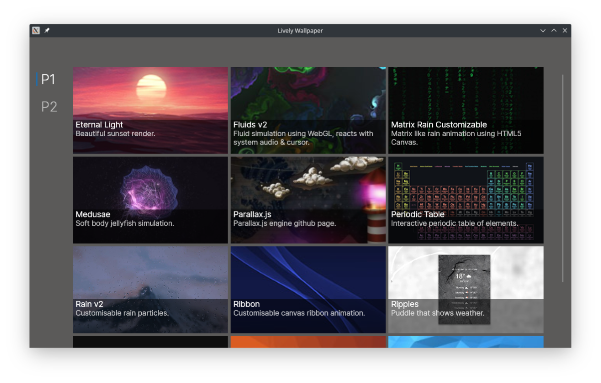

# Lively Linux   ![Badge Contributions]   [![Badge License]][License]

*Experimental Linux version of **[Lively Wallpaper]**.*

<br>

<div align = center>



</div>

<br>
<br>

## Progress

The project is in it's very early stages and <br>
wallpapers do not work yet, however the <br>
basic user interface works by now.

<br>

### Plans

*Everything is subject to change.*

- Language / Runtime : **[.NET 5 SDK]**

- Video Player : **[MPV]** / **[MPV.Net]**

- Interface : **[AvaloniaUI]**

- Web Browser : ***???***

- Desktop : ***KDE ???***

<br>
<br>

## Data

Wallpapers are saved in:

`<app_folder>/userdata/library/wallpapers`

<br>
<br>

## Building

1.  Install the **[.NET 5 SDK]**

2. Navigate to project folder

3. Build the project with:

    ```shell
    dotnet build
    ```

<br>


<!----------------------------------------------------------------------------->

[Lively Wallpaper]: https://github.com/rocksdanister/lively
[AvaloniaUI]: https://github.com/AvaloniaUI/Avalonia
[.NET 5 SDK]: https://dotnet.microsoft.com/download
[MPV.Net]: https://github.com/mireo91/Mpv.NET-lib-
[MPV]: https://github.com/mpv-player/mpv

[License]: LICENSE


<!---------------------------------[ Badges ]---------------------------------->

[Badge Contributions]: https://img.shields.io/badge/Contributions-Welcome-327c25?style=for-the-badge&logoColor=white&logo=GitHub&labelColor=44A833
[Badge License]: https://img.shields.io/badge/License-GPL_3-02639a.svg?style=for-the-badge&labelColor=blue